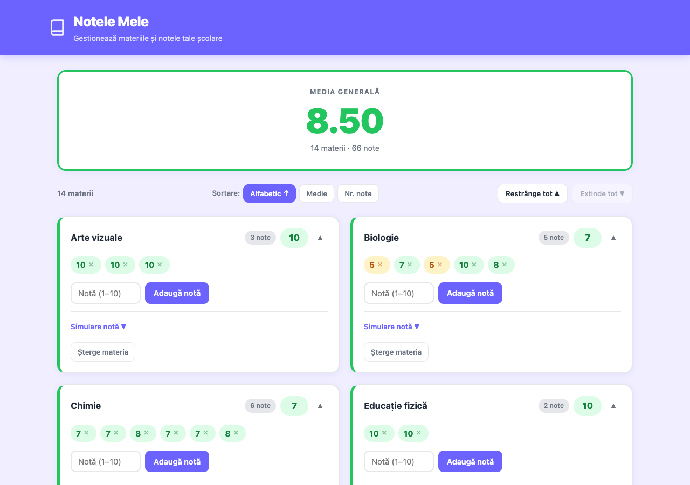
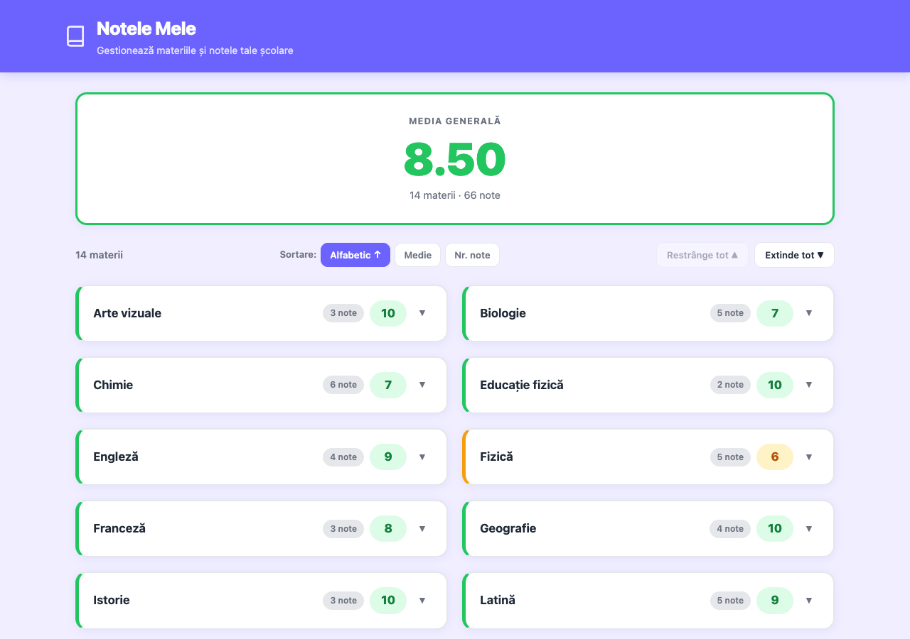
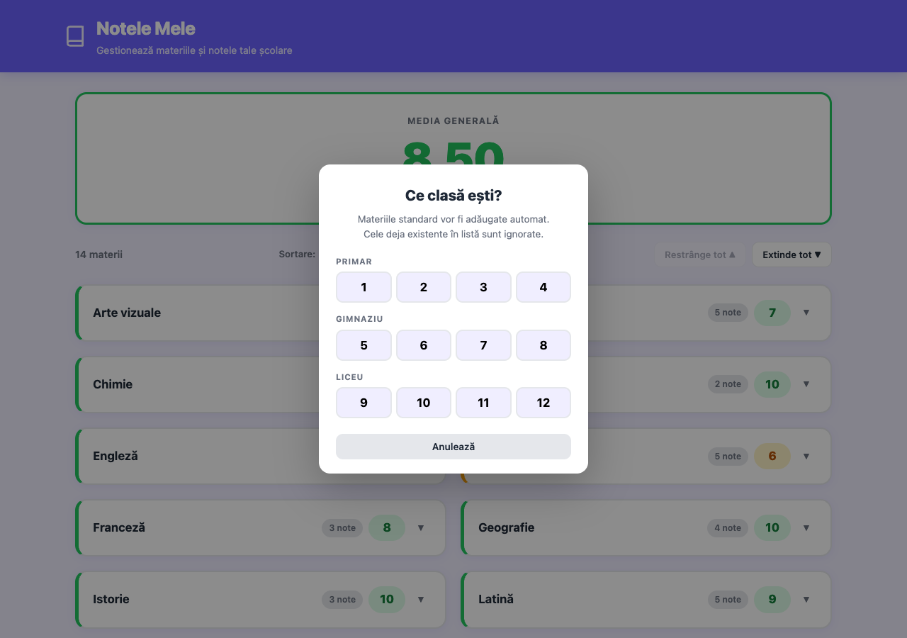

# Notele Mele 📚

**Aplicație web pentru gestionarea notelor școlare** — urmărește materiile, calculează mediile și primește sugestii pentru îmbunătățirea performanței.

🔗 **[Deschide aplicația live](https://im-trainer.github.io/school-grades/)**

---

## De ce există această aplicație?

Urmărirea notelor în mai multe caiete, carnete sau fișiere Excel este obositoare și ușor de pierdut. **Notele Mele** rezolvă asta simplu: totul într-o singură pagină web, salvat automat în browser, fără cont și fără server.

Aplicația e gândită special pentru elevii din România:
- Folosește sistemul de notare **1–10**
- Vine cu **materii preîncărcate** pentru fiecare clasă (1–12), bazate pe programa națională
- Media fiecărei materii e calculată și **rotunjită** exact cum o face școala
- Funcția **Simulare notă** arată ce medie ai obține dacă ai lua o notă în plus — util pentru a te motiva la materiile slabe

---

## Funcționalități principale

| Funcție | Descriere |
|---|---|
| ➕ Adaugă / editează / șterge materii și note | Gestionare completă |
| 📊 Medie automată rotunjită | Per materie și medie generală cu 2 zecimale |
| 🎯 Simulare notă (Smart Hints) | Slider 1–10 pe fiecare materie |
| 📂 Materii implicite pe clasă | Clase 1–12, programa națională RO |
| 🔽 Colapsare / expandare carduri | Vizualizare compactă sau detaliată |
| 🔃 Sortare materii | Alfabetic / Medie / Nr. note, crescător/descrescător |
| 💾 Salvare automată | localStorage — date păstrate la refresh |
| 📤 Export CSV | Compatible Excel (UTF-8 BOM) |
| 📥 Import CSV | Înlocuire date din fișier CSV |

---

## Capturi de ecran

### Dashboard — vedere generală cu note


### Vedere compactă — carduri colapsate


### Simulare notă — Smart Hints


### Selectare clasă pentru materii implicite


---

## Utilizare rapidă

1. Deschide [aplicația](https://im-trainer.github.io/school-grades/)
2. Apasă **Materii implicite** și selectează clasa ta → materiile se adaugă automat
3. Introdu notele pe fiecare materie
4. Urmărește media generală în timp real
5. Folosește **Simulare notă** pe materiile slabe pentru a vedea cât de mult contează o notă în plus

### Import din CSV

Poți importa un fișier CSV cu formatul:
```
Materie,Nota 1,Nota 2,...,Nota 10
Română,8,7,9,6
Matematică,7,5,8
```

Un fișier exemplu pentru clasa a 7-a este disponibil: [`exemplu-cl-7.csv`](exemplu-cl-7.csv)

---

## Tehnologii

- **React 18** + **Vite 5** — SPA fără backend
- **CSS plain** — fără framework CSS, responsive mobile/desktop
- **localStorage** — persistență locală, fără cont
- **GitHub Actions** — deploy automat pe GitHub Pages la orice push pe `main`
